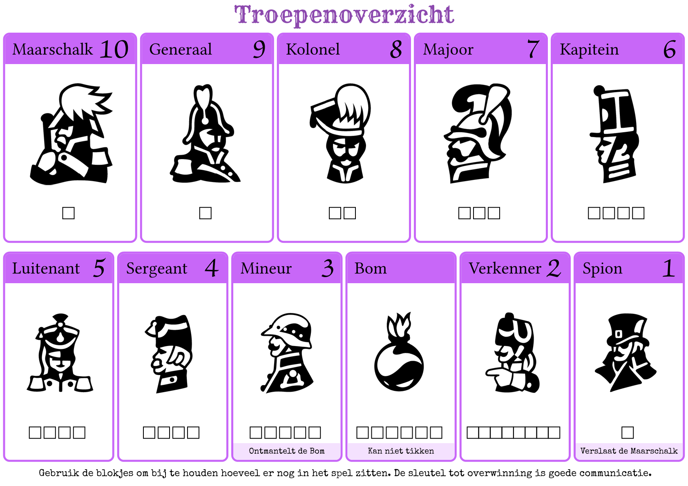

# [Levend stratego](https://nl.wikipedia.org/wiki/Levend_stratego) kaartjes

<a href="levend_stratego.pdf">Link naar de pdf</a>   

De pdf is gemaakt met [typst](https://typst.app/). Je kan zelf de pdf genereren door `just` of `typst compile levend_stratego.typ` uit te voeren. 